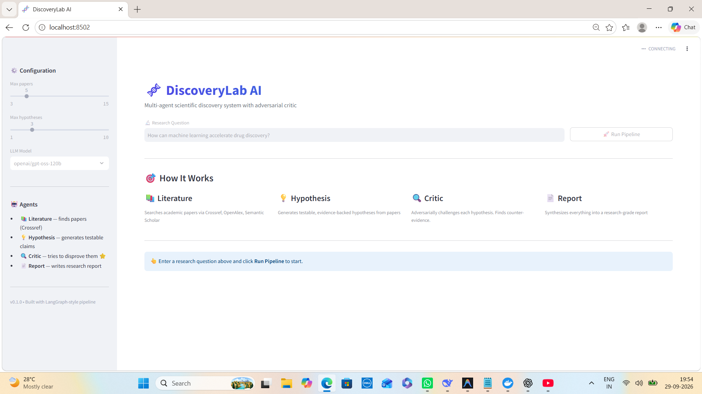

# 🧬 DiscoveryLab AI

<div align="center">

**Multi-Agent Scientific Discovery System with an Adversarial Critic**

*Generate testable hypotheses from scientific literature — then actively try to disprove them.*

[](https://www.python.org/)
[](https://streamlit.io/)
[](https://www.docker.com/)
[](https://groq.com/)
[](LICENSE)

[**🚀 Quick Start**](#-quick-start) •
[**🏗️ Architecture**](#️-architecture) •
[**🤖 Agents**](#-agents) •
[**📊 Example Output**](#-example-output) •
[**🧪 Testing**](#-testing)

</div>

---

## 📌 Overview

**DiscoveryLab AI** is a multi-agent scientific research system that transforms a research question into a structured discovery workflow.

Instead of generating hypotheses and immediately accepting them, DiscoveryLab introduces a dedicated **Adversarial Critic Agent** that evaluates each hypothesis against weaknesses, counter-evidence, alternative explanations, and experimental requirements.

```text
Research Question
       │
       ▼
📚 Literature Search
       │
       ▼
💡 Hypothesis Generation
       │
       ▼
🔍 Adversarial Critique
       │
       ├── Counter-evidence
       ├── Weaknesses
       ├── Alternative explanations
       └── Required experiments
       │
       ▼
📊 Confidence Assessment
       │
       ├── ACCEPT
       ├── NEEDS_EXPERIMENT
       └── REJECT
       │
       ▼
📄 Research Report
```

The goal is not to make the model appear more confident. The goal is to create a workflow where generated scientific claims are **challenged before being synthesized into the final report**.

---

# 🎯 Why DiscoveryLab?

A simple LLM research workflow often looks like:

```text
Literature
    ↓
LLM
    ↓
Hypothesis
    ↓
Report
```

DiscoveryLab adds an explicit adversarial evaluation stage:

```text
Literature
    ↓
Hypothesis
    ↓
🔍 Critic
    ↓
Evidence + Counter-evidence
    ↓
Verdict
    ↓
Report
```

The Critic Agent specifically looks for:

* ⚠️ Hidden assumptions
* 🔬 Confounding factors
* 📉 Data and sampling bias
* 🚫 Contradictory evidence
* 🔄 Alternative explanations
* 🧪 Missing validation experiments
* 📊 Evidence balance
* 🎯 Confidence assessment

This creates a more structured research workflow where hypotheses are treated as **claims to investigate**, rather than conclusions to accept automatically.

---

# 📸 Screenshot



> Streamlit interface showing the multi-agent pipeline: Literature → Hypothesis → Critic → Report.

---

# 🏗️ Architecture

```text
                         RESEARCH QUESTION
                                │
                                ▼
                       ┌─────────────────┐
                       │  MASTER FLOW    │
                       └────────┬────────┘
                                │
             ┌──────────────────┼──────────────────┐
             │                  │                  │
             ▼                  ▼                  ▼
      ┌─────────────┐    ┌─────────────┐    ┌─────────────┐
      │ 📚          │    │ 💡          │    │ 🔬          │
      │ Literature  │    │ Hypothesis  │    │ Experiment  │
      │ Agent       │    │ Agent       │    │ Roadmap     │
      └──────┬──────┘    └──────┬──────┘    └─────────────┘
             │                  │
             └──────────┬───────┘
                        │
                        ▼
                ┌───────────────┐
                │ 🔍 CRITIC     │
                │     AGENT     │
                └───────┬───────┘
                        │
             ┌──────────┼──────────┐
             │          │          │
             ▼          ▼          ▼
         Weaknesses  Counter-   Alternatives
                     evidence
                        │
                        ▼
                Confidence Score
                     0.0–1.0
                        │
             ┌──────────┼──────────┐
             ▼          ▼          ▼
          ACCEPT      NEEDS      REJECT
                    EXPERIMENT
             │          │          │
             └──────────┼──────────┘
                        ▼
                 ┌──────────────┐
                 │ 📄 REPORT    │
                 │    AGENT     │
                 └──────┬───────┘
                        ▼
                 Research Report
```

---

# 🤖 Agents

| Agent                   | Responsibility                                                   | Output                                     |
| ----------------------- | ---------------------------------------------------------------- | ------------------------------------------ |
| 📚 **Literature Agent** | Searches academic sources using multiple providers with fallback | Relevant papers + metadata                 |
| 💡 **Hypothesis Agent** | Generates testable, evidence-backed hypotheses                   | Hypotheses + rationale + testability       |
| 🔍 **Critic Agent** ⭐   | Adversarially evaluates each hypothesis                          | Weaknesses + counter-evidence + confidence |
| 📄 **Report Agent**     | Synthesizes literature, hypotheses, and critiques                | Markdown + JSON research report            |

---

# 📚 Literature Agent

The Literature Agent searches multiple academic data sources:

```text
Crossref
   ↓
OpenAlex
   ↓
Semantic Scholar
```

If one source encounters an API problem, the system can fall back to another configured source.

The resulting literature metadata is passed into the downstream hypothesis generation workflow.

### Sources

* Crossref
* OpenAlex
* Semantic Scholar

---

# 💡 Hypothesis Agent

The Hypothesis Agent analyzes the retrieved literature and generates **potential testable hypotheses**.

A hypothesis contains information such as:

```text
Hypothesis
├── Claim
├── Rationale
├── Supporting evidence
├── Testability
└── Expected validation path
```

The objective is to convert literature observations into claims that can be investigated experimentally.

---

# 🔍 Critic Agent ⭐

The Critic Agent is the central component of DiscoveryLab.

Instead of asking:

> "Does this hypothesis sound reasonable?"

it asks:

> **"What evidence or reasoning could show that this hypothesis is wrong?"**

For each hypothesis, the Critic analyzes:

### ⚠️ Weaknesses

Potential assumptions, confounders, biases, and methodological limitations.

### 🚫 Counter-Evidence

Evidence that contradicts or weakens the proposed hypothesis.

### 🔄 Alternative Explanations

Other mechanisms or explanations that could produce the same observed outcome.

### 🧪 Required Experiments

Experiments that could provide stronger evidence for or against the hypothesis.

### 📊 Confidence

A structured confidence score between:

```text
0.0 ─────────────────────────── 1.0
Low                              High
```

The score represents the system's assessment of the evidence available to the workflow; it should not be interpreted as a statistical probability unless separately calibrated.

---

# ⚖️ Critic Verdicts

The Critic produces one of three workflow-level outcomes:

| Verdict                 | Meaning                                                                       |
| ----------------------- | ----------------------------------------------------------------------------- |
| 🟢 **ACCEPT**           | Current evidence supports continuing with the hypothesis                      |
| 🟡 **NEEDS_EXPERIMENT** | Evidence is insufficient or conflicting; additional validation is recommended |
| 🔴 **REJECT**           | The critique identifies substantial issues or contradictory evidence          |

These verdicts are **research workflow outputs**, not substitutes for experimental validation or peer review.

---

# 📊 Example Output

### Research Question

> **How can machine learning accelerate drug discovery?**

### Generated Hypothesis H-001

> Graph neural networks trained on curated bioactivity data may improve prospective hit identification for novel chemical scaffolds compared with a selected traditional docking baseline.

### Critic Verdict

```text
H-001 — NEEDS_EXPERIMENT

Confidence: 0.62

⚠️ WEAKNESSES
• Training data may be biased toward well-studied chemotypes
• Docking baseline performance can vary substantially
• Observed differences may depend on dataset and evaluation design

🚫 COUNTER-EVIDENCE
• Some prospective evaluations have reported limited gains
• GNN performance can degrade on out-of-distribution chemical scaffolds

🧪 REQUIRED EXPERIMENTS
• Prospective comparison across multiple mechanistically distinct targets
• Predefined evaluation protocol
• Controlled comparison against selected docking baselines
• Independent validation on previously unseen chemical scaffolds
```

The Report Agent then combines the available evidence and critiques into a structured Markdown report.

---

# 📄 Generated Research Report

The final report can contain:

```text
Research Report
│
├── Executive Summary
│
├── Research Question
│
├── Literature Review
│
├── Generated Hypotheses
│
├── Critic Analysis
│   ├── Weaknesses
│   ├── Counter-Evidence
│   ├── Alternative Explanations
│   └── Confidence
│
├── Verdicts
│
├── Recommended Experiments
│
└── References
```

Reports can be exported in:

* Markdown
* JSON

---

# 🖥️ Streamlit UI

DiscoveryLab provides a Streamlit interface for interacting with the research pipeline.

### UI Features

* 🔄 **Live pipeline progress**
* 📚 **Literature tab**
* 💡 **Hypotheses tab**
* 🔍 **Critiques tab**
* 📄 **Report tab**
* 📊 **Confidence visualization**
* 🟢🟡🔴 **Verdict indicators**
* ⬇️ **Markdown and JSON report download**
* ⚙️ **Configurable paper and hypothesis limits**
* 🧠 **Configurable LLM model**

---

# 🛠️ Tech Stack

| Layer                | Technology                  | Purpose                        |
| -------------------- | --------------------------- | ------------------------------ |
| **Language**         | Python 3.11                 | Core implementation            |
| **LLM**              | Groq                        | LLM inference                  |
| **Models**           | GPT-OSS-120B / Llama 3.3    | Research reasoning             |
| **Orchestration**    | Custom Multi-Agent Pipeline | Agent coordination             |
| **Literature**       | Crossref                    | Academic metadata              |
| **Literature**       | OpenAlex                    | Academic discovery             |
| **Literature**       | Semantic Scholar            | Academic discovery + fallback  |
| **UI**               | Streamlit                   | Interactive research dashboard |
| **Resilience**       | Tenacity                    | Retry + exponential backoff    |
| **Containerization** | Docker                      | Reproducible deployment        |
| **Deployment**       | Docker Compose              | Multi-container execution      |

---

# 🔄 Resilience & API Fallback

Scientific literature APIs can fail because of:

* Rate limits
* Temporary service errors
* Network failures
* Provider-specific response errors

DiscoveryLab uses retry logic and multiple literature sources.

```text
                Literature Request
                       │
                       ▼
                  Crossref
                       │
                 ┌─────┴─────┐
                 │           │
               Success     Failure
                 │           │
                 ▼           ▼
               Result     OpenAlex
                              │
                        ┌─────┴─────┐
                        │           │
                      Success     Failure
                        │           │
                        ▼           ▼
                      Result   Semantic Scholar
```

Tenacity provides retry behavior with exponential backoff for supported transient failures.

---

# 📁 Project Structure

```text
discoverylab/
│
├── src/
│   │
│   ├── agents/
│   │   ├── literature_agent.py
│   │   ├── hypothesis_agent.py
│   │   ├── critic_agent.py
│   │   └── report_agent.py
│   │
│   ├── core/
│   │   └── llm_client.py
│   │
│   └── serving/
│       └── app.py
│
├── configs/
│   └── config.yaml
│
├── data/
│   └── # Papers, hypotheses and evidence
│
├── reports/
│   └── # Generated research reports
│
├── docs/
│   └── screenshot.png
│
├── Dockerfile
├── docker-compose.yml
├── requirements.txt
└── README.md
```

---

# 🚀 Quick Start

## Option 1 — Local Python

### 1. Clone

```bash
git clone https://github.com/vaibhav07772/discoverylab.git
cd discoverylab
```

### 2. Create Environment

```bash
conda create -n discoverylab python=3.11 -y
conda activate discoverylab
```

### 3. Install Dependencies

```bash
pip install -r requirements.txt
```

### 4. Configure Groq

Create a `.env` file:

```env
GROQ_API_KEY=your_groq_api_key
```

Keep `.env` out of version control.

### 5. Start Streamlit

```bash
streamlit run src/serving/app.py
```

Open:

```text
http://localhost:8501
```

---

# 🐳 Option 2 — Docker

Build the image:

```bash
docker build -t discoverylab:latest .
```

Run:

```bash
docker run \
  -p 8501:8501 \
  --env-file .env \
  discoverylab:latest
```

Open:

```text
http://localhost:8501
```

---

# 🐳 Option 3 — Docker Compose

```bash
docker-compose up
```

Stop:

```bash
docker-compose down
```

---

# 🧪 Testing

Run the complete pipeline:

```bash
python -m src.agents.report_agent
```

Run individual components:

```bash
python -m src.agents.literature_agent
```

```bash
python -m src.agents.hypothesis_agent
```

```bash
python -m src.agents.critic_agent
```

---

# 🧠 Key Engineering Concepts

DiscoveryLab demonstrates several important AI engineering patterns:

### 1. Multi-Agent Architecture

Each agent has a focused responsibility:

```text
Literature
    ↓
Hypothesis
    ↓
Critic
    ↓
Report
```

This separates research discovery, hypothesis generation, evaluation, and synthesis.

### 2. Adversarial Evaluation

Instead of using one LLM call to generate and accept a hypothesis, a separate Critic stage attempts to identify reasons the hypothesis may fail.

### 3. Structured LLM Output

Agent outputs are designed around structured fields rather than relying entirely on free-form responses.

### 4. External Knowledge Retrieval

The system retrieves literature from academic data providers before generating hypotheses.

### 5. Resilient API Integration

Multiple literature providers and retry logic reduce dependence on a single external API.

### 6. Containerized Execution

Docker provides a reproducible environment for running the application.

---

# ⚠️ Limitations

DiscoveryLab is an **AI-assisted research workflow**, not an autonomous scientific laboratory.

Current limitations include:

* Generated hypotheses require human scientific review.
* Literature metadata does not guarantee that the underlying paper fully supports a generated claim.
* LLM-generated critiques can themselves contain errors.
* Confidence scores are model-generated assessments and are not statistically calibrated probabilities.
* Full-text PDF analysis is not currently implemented.
* Biomedical-specific retrieval through PubMed is part of the roadmap.
* Experimental validation is not automatically performed.
* Current interface is primarily English-focused.
* External literature APIs can impose rate limits or availability constraints.

---

# 🔮 Roadmap

## ✅ Completed

* [x] Literature Agent
* [x] Crossref integration
* [x] OpenAlex integration
* [x] Semantic Scholar fallback
* [x] Hypothesis Agent
* [x] Adversarial Critic Agent
* [x] Confidence scoring
* [x] Research Report Agent
* [x] Streamlit interface
* [x] Docker deployment
* [x] Retry and API fallback handling

## 🚧 Planned

* [ ] **RAG Pipeline**

  * ChromaDB
  * Embeddings
  * Semantic paper retrieval

* [ ] **Experiment Agent**

  * Computational experiment design
  * Baseline selection
  * Evaluation metrics

* [ ] **Citation Agent**

  * Citation verification
  * Source-to-claim matching

* [ ] **PubMed Integration**

  * Biomedical literature retrieval

* [ ] **PDF Processing**

  * Full-text extraction
  * Section-aware retrieval

* [ ] **Parallel Agent Execution**

  * LangGraph-based orchestration
  * Async execution

* [ ] **Research Memory**

  * Persistent literature memory
  * Previous hypothesis tracking

---

# 🎓 What I Learned

Building DiscoveryLab provided practical experience with:

* Multi-agent AI architecture
* Agent specialization
* Adversarial LLM evaluation
* Scientific literature retrieval
* Hypothesis generation
* Structured LLM outputs
* Confidence-based decision workflows
* API fallback strategies
* Retry and exponential backoff
* Streamlit application development
* Docker containerization
* Research-oriented AI system design

---

# 💼 Interview Explanation

### What is DiscoveryLab AI?

> **DiscoveryLab AI is a multi-agent scientific discovery system that retrieves academic literature, generates testable hypotheses, adversarially critiques those hypotheses, and synthesizes the resulting evidence into a structured research report.**

### Why did you build it?

> I wanted to explore a research workflow where an LLM is not only used for generation but also for structured criticism. The system separates literature discovery, hypothesis generation, adversarial evaluation, and reporting into specialized agents.

### What is the most important component?

> The Critic Agent is the key component because it introduces an explicit adversarial stage. Instead of directly passing generated hypotheses to the final report, the system looks for weaknesses, counter-evidence, alternative explanations, and experiments that could validate or reject the hypothesis.

### Why multiple agents?

> Each stage has a different responsibility. Separating them makes the workflow easier to reason about, test, modify, and extend.

### Is the generated hypothesis scientifically proven?

> No. The system generates research hypotheses and evaluates available evidence, but the final scientific claim requires human review and experimental validation.

---

# 🤝 Contributing

Contributions are welcome.

For major changes, please open an issue first to discuss the proposed change.

```bash
git checkout -b feature/your-feature
git commit -m "Add your feature"
git push origin feature/your-feature
```

Then open a Pull Request.

---

# 📄 License

MIT License

Copyright © **Vaibhav Singh**

---

# 🙏 Acknowledgements

* [Groq](https://groq.com/) — LLM inference
* [Crossref](https://www.crossref.org/) — scholarly metadata
* [OpenAlex](https://openalex.org/) — open scholarly data
* [Semantic Scholar](https://www.semanticscholar.org/) — academic search and metadata
* [Streamlit](https://streamlit.io/) — research dashboard
* [Tenacity](https://tenacity.readthedocs.io/) — retry and resilience
* [Docker](https://www.docker.com/) — containerization

Inspired by research automation systems such as **AI Scientist** and agent orchestration frameworks such as **LangGraph**.

---

<div align="center">

## 🧬 DiscoveryLab AI

**Literature → Hypothesis → Critique → Evidence → Experiment → Report**

Built with ❤️ using **Python · Groq · Streamlit · Docker · Multi-Agent AI**

⭐ **If you find this project useful, consider giving the repository a star!**

</div>
